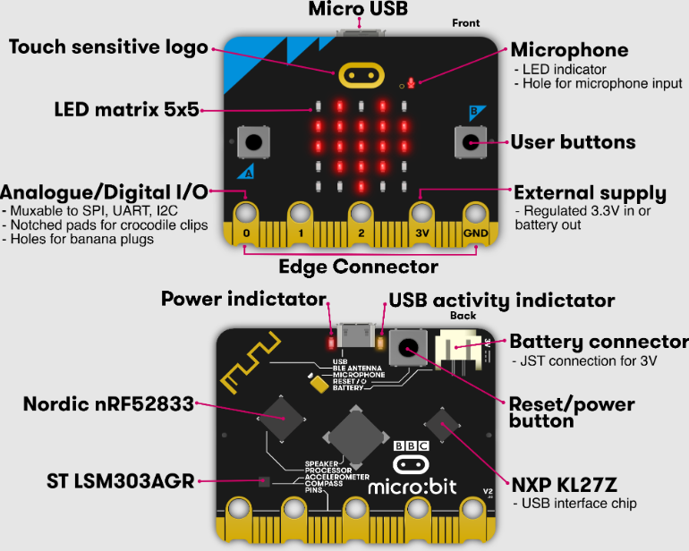
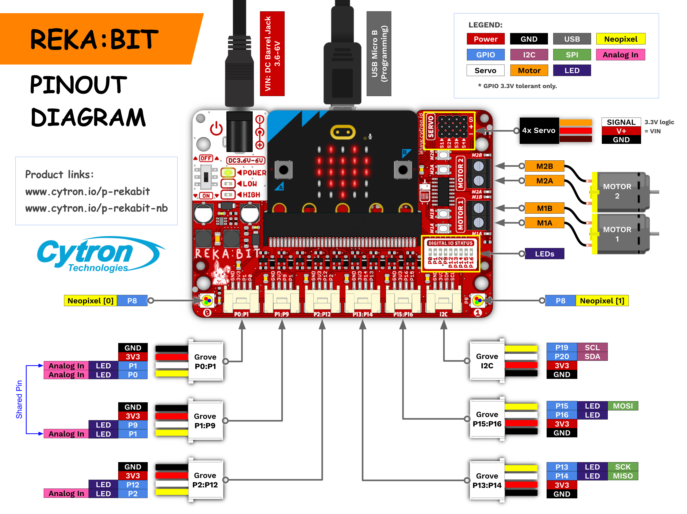
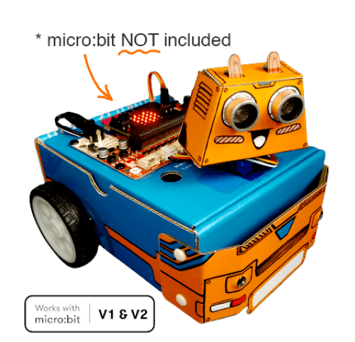

# BBC micro:bit, reka:bit và Zoom:bit KIT

Tài liệu đào tạo nội bộ, sử dụng bộ Kit Zoom:bit zip zip để thực hành cho học viên - Softech Aptech

Nguồn Chương trình đào tạo: <https://microbit.org>

Đơn vị phân phối: <https://www.cytrontech.vn/c-micro-bit>

## 1. Micro:bit

Thông tin phần cứng micro:bit V2.x

Thông số kỹ thuật và tính năng:

*   Vi xử lý 32-bit ARM **Cortex-M4**
*   Vi điều khiển chính: Nordic Semiconductor **nRF52833**
*   Xung nhịp: **64MHz**
*   Bộ nhớ: **512KB Flash**
*   RAM: **128KB RAM**
*   Giao tiếp USB: **NXP KL27Z with 32KB RAM**
*   Đèn LED ma trận màu đỏ 5x5
*   Hai nút nhấn có thể lập trình
*   **Cảm biến chạm tại logo micro:bit** 
*   Có thêm đèn LED báo nguồn và Mic
*   **Được trang bị microphone MEMS**
*   Được trang bị cảm biến gia tốc, la bàn, ánh sáng và nhiệt độ 
*   Kết nối không dây sử dụng **Bluetooth 5.1**, **BLE** và 2.4GHz Radio
*   Các đầu kết nối:
    *   Tổng cộng 25 pin
    *   **4 GPIO riêng biệt:** PWM, I2C, SPI, Nguồn
    *   5 chân kết nối hình tròn (ring), có thể sử dụng với kẹp nguồn cá sấu
*   **Có nút nguồn để tắt bo mạch**
*   Kết nối microB USB
*   Kết nối Pin JST-PH
*   Có nút Reset với đèn LED
*   Dòng điện có thể cấp cho các thiết bị ngoại vi: **3V, 200mA**
*   Lập trình với: C++, Makecode, Python, Scratch
*   Kích thước: 5cm (w) x 4cm (h)

## 2. Reka:bit

Thông số kỹ thuật và tính năng:

*   2x Kết nối động cơ DC
    *   có sẵn nút kiểm tra động cơ (không cần code)
*   4x Kết nối động cơ servo
*   2x LED RGB Neopixel
*   6x Cổng Grove (3.3V)
    *   3x Cổng Analog Input / Digital IO
    *   2x Cổng Digital IO
    *   1x Cổng I2C 
*   DC Jack để cấp nguồn (3.6 - 6VDC)
*   Công tắc ON/OFF
*   Đèn báo nguồn
*   Đèn báo & mạch bảo vệ thiếu áp (LOW) 
*   Đèn báo & mạch bảo vệ thiếu áp quá áp (HIGH)

## 3. Zoom:bit

Là bột KIT xe Robot Thông Minh

*   1x Bo mạch BBC micro:bit V2
*   1x Bo mạch mở rộng REKA:BIT 
*   1x Nguồn USB và cáp dữ liệu
*   1x 9+1 Sách hướng dẫn 
*   1x bản thu phóng
*   1x Cảm biến Dòng Maker 
*   1x Cảm biến siêu âm 
*   2x Module đèn LED 10mm 
*   2x Động cơ DC có bánh xe
*   1x Động cơ servo Micro
*   4x Grove sang cáp header cái
*   1x 4xAA ngăn chứa pin với phích cắm DC 
*   4x Pin AA
*   1x Castor
*   1x Tuốt nơ vít Mini
*   Đinh tán
*   Băng keo hai mặt